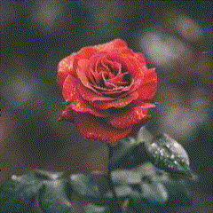

libsecam
========

## Description

This header-only library provides a video effect simulating so-called _SECAM
fire_: color noise specific to SECAM analog TV standard. The noise looks like
a red, blue and sometimes green horizontal stripes and it might be familiar
for those grown up in France, the former Soviet Union or in the Middle East.

## Input and output

Input format is an array of `width` * `height` pixels. The pixel consists of
4 bytes: red, green, blue and unused (XRGB). The output is the same.

## Usage

Refer to `ueit.c` for basic usage.
